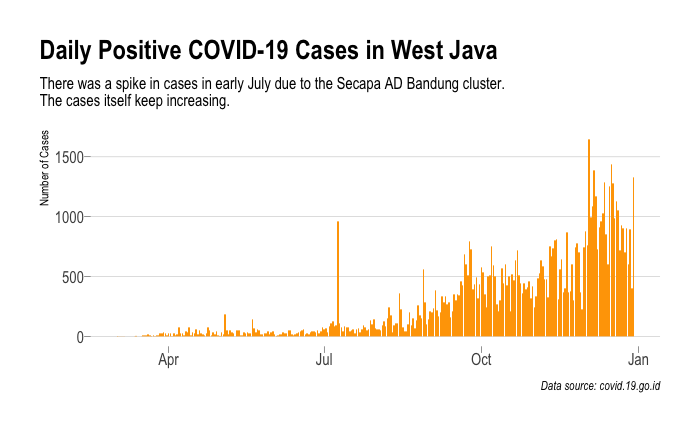
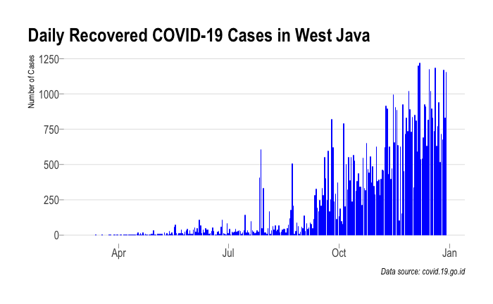
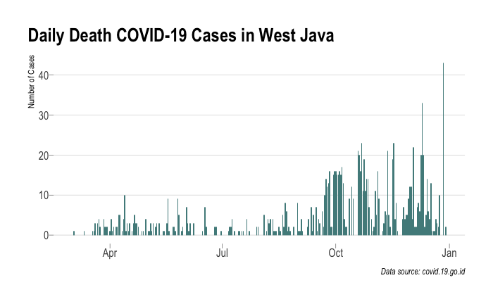
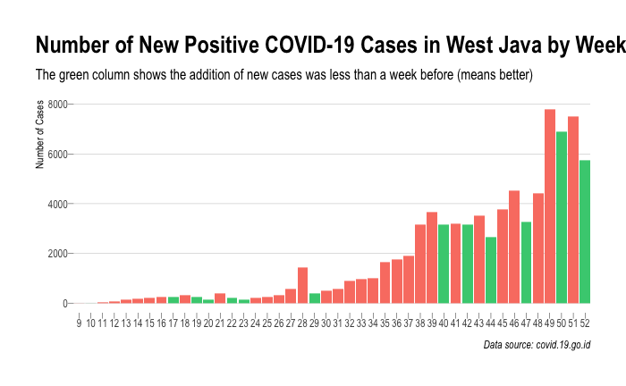
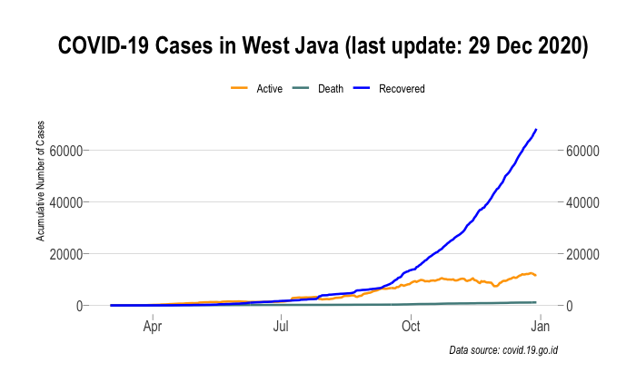

### Overview
In this project, I want to see how the development of Covid-19 cases specifically in West Java, Indonesia. It is a mini-project from Data Science course in DQLab Academy. 

### Installation
```{r eval=FALSE, message=FALSE}
install.packages("httr")
install.packages("dplyr")
install.packages("ggplot2")
install.packages("hrbrthemes")
install.packages("lubridate")
install.packages("tidyr")
```

### Initialization
```{r eval=FALSE, message=FALSE}
library("httr")
library("dplyr")
library("ggplot2")
library("hrbrthemes")
library("lubridate")
library("tidyr")
```

## Covid-19 Data in Indonesia
### Accessing Data
All the data is accessed from https://data.covid19.go.id/public/api/update.json

```{r eval=FALSE, message=FALSE}
resp <- GET("https://data.covid19.go.id/public/api/update.json")
```

To check the API response, whether it is functional or not:
```{r eval=FALSE, message=FALSE}
status_code(resp)
#[1] 200
```

-200 means OK, 
-404 means data not found, 
-403 means access denied, and
-500 means server error

To find out metadata,
```{r eval=FALSE, message=FALSE}
headers(resp)
```

### Extracting content of response
```{r eval=FALSE, message=FALSE}
cov_id_raw <- content(resp, as = "parsed", simplifyVector = TRUE)
length(cov_id_raw)
names(cov_id_raw)
```
There are two objects in the data frame: "data" and "update". I will analyze the update.
```{r eval=FALSE, message=FALSE}
cov_id_update <- cov_id_raw$update
```

### Analysis
```{r eval=FALSE, message=FALSE}
lapply(cov_id_update, names)
```

Last update date
```{r eval=FALSE, message=FALSE}
cov_id_update$penambahan$tanggal
#[1] "2020-12-29"
```

An increasing number of recovered cases
```{r eval=FALSE, message=FALSE}
cov_id_update$penambahan$jumlah_sembuh
#[1] 6805
```

An increasing number of death cases
```{r eval=FALSE, message=FALSE}
cov_id_update$penambahan$jumlah_meninggal
#[1] 251
```

A total number of positive cases
```{r eval=FALSE, message=FALSE}
cov_id_update$total$jumlah_positif
#[1] 727122
```

A total number of death cases
```{r eval=FALSE, message=FALSE}
cov_id_update$total$jumlah_meninggal
#[1] 21703
```

## Covid-19 data in West Java (Jabar)
1. Accessing the data from API
2. Extracting the content

```{r eval=FALSE, message=FALSE}
resp_jabar <- GET("https://data.covid19.go.id/public/api/prov_detail_JAWA_BARAT.json")
cov_jabar_raw <- content(resp_jabar, as = "parsed", simplifyVector = TRUE)

names(cov_jabar_raw)
#[1] "last_date"            "provinsi"             "kasus_total"          "kasus_tanpa_tgl"     
#[5] "kasus_dengan_tgl"     "meninggal_persen"     "meninggal_tanpa_tgl"  "meninggal_dengan_tgl"
#[9] "sembuh_persen"        "sembuh_tanpa_tgl"     "sembuh_dengan_tgl"    "list_perkembangan"
cov_jabar_raw$kasus_total
#[1] 81322 (Total cases)
cov_jabar_raw$meninggal_persen
#[1] 1.426428 (Death percentage)
cov_jabar_raw$sembuh_persen
#[1] 84.42857 (Recovered cases percentage)
```

### Historical data on the development of Covid-19
To find out how the Covid-19 is going in West Java, I choose to focus on the development of the cases by using a data frame named "list_perkembangan"
```{r eval=FALSE, message=FALSE}
cov_jabar <- cov_jabar_raw$list_perkembangan
str(cov_jabar)
#'data.frame':	303 obs. of  9 variables:
# $ tanggal                     : num  1.58e+12 1.58e+12 1.58e+12 1.58e+12 1.58e+12 ...
# $ KASUS                       : int  3 1 1 1 1 0 0 0 0 0 ...
# $ MENINGGAL                   : int  0 1 0 0 0 0 0 0 0 1 ...
# $ SEMBUH                      : int  0 0 0 0 0 0 0 0 0 0 ...
# $ DIRAWAT_OR_ISOLASI          : int  3 0 1 1 1 0 0 0 0 -1 ...
# $ AKUMULASI_KASUS             : int  3 4 5 6 7 7 7 7 7 7 ...
# $ AKUMULASI_SEMBUH            : int  0 0 0 0 0 0 0 0 0 0 ...
# $ AKUMULASI_MENINGGAL         : int  0 1 1 1 1 1 1 1 1 2 ...
# $ AKUMULASI_DIRAWAT_OR_ISOLASI: int  3 3 4 5 6 6 6 6 6 5 ...
head(cov_jabar)
```

#### Taming Data
```{r eval=FALSE, message=FALSE}
new_cov_jabar <-
  cov_jabar %>% 
  select(-contains("DIRAWAT_OR_ISOLASI")) %>% 
  select(-starts_with("AKUMULASI")) %>% 
  rename(
    kasus_baru = KASUS,
    meninggal = MENINGGAL,
    sembuh = SEMBUH
  ) %>% 
  mutate(
    tanggal = as.POSIXct(tanggal / 1000, origin = "1970-01-01"),
    tanggal = as.Date(tanggal)
  )
str(new_cov_jabar)
#'data.frame':	303 obs. of  4 variables:
# $ tanggal   : Date, format: "2020-03-02" "2020-03-03" "2020-03-04" ...
# $ kasus_baru: int  3 1 1 1 1 0 0 0 0 0 ...
# $ meninggal : int  0 1 0 0 0 0 0 0 0 1 ...
# $ sembuh    : int  0 0 0 0 0 0 0 0 0 0 ...
```

### Data Visualization
Using column bar chart for showing Daily Positive Cases in West Java
```{r eval=FALSE, message=FALSE}
ggplot(new_cov_jabar, aes(tanggal, kasus_baru)) +
  geom_col(fill = "orange") +
  labs(
    x = NULL,
    y = "Number of Cases",
    title = "Daily Positive COVID-19 Cases in West Java",
    subtitle = "There was a spike in cases in early July due to the Secapa AD Bandung cluster.\nThe cases itself keep increasing.",
    caption = "Data source: covid.19.go.id"
  ) +
  theme_ipsum(
    base_size = 12,
    plot_title_size = 20,
    grid = "Y",
    ticks = TRUE
  ) +
  theme(plot.title.position = "plot")
```


Using column bar chart for showing Daily Recovered Cases in West Java
```{r eval=FALSE, message=FALSE}
ggplot(new_cov_jabar, aes(tanggal, sembuh)) +
  geom_col(fill = "blue") +
  labs(
    x = NULL,
    y = "Number of Cases",
    title = "Daily Recovered COVID-19 Cases in West Java",
    caption = "Data source: covid.19.go.id"
  ) +
  theme_ipsum(
    base_size = 12, 
    plot_title_size = 20,
    grid = "Y",
    ticks = TRUE
  ) +
  theme(plot.title.position = "plot")
```


Using column bar chart for showing Daily Death Cases in West Java
```{r eval=FALSE, message=FALSE}
ggplot(new_cov_jabar, aes(tanggal, meninggal)) +
  geom_col(fill = "darkslategray4") +
  labs(
    x = NULL,
    y = "Number of Cases",
    title = "Daily Death COVID-19 Cases in West Java",
    caption = "Data source: covid.19.go.id"
  ) +
  theme_ipsum(
    base_size = 12, 
    plot_title_size = 20,
    grid = "Y",
    ticks = TRUE
  ) +
  theme(plot.title.position = "plot")
```


### Development of COVID-19 Cases Number
Calculating number of new cases per week
```{r eval=FALSE, message=FALSE}
cov_jabar_pekanan <- new_cov_jabar %>% 
  count(
    tahun = year(tanggal),
    pekan_ke = week(tanggal),
    wt = kasus_baru,
    name = "jumlah"
  )
glimpse(cov_jabar_pekanan)
#Rows: 44
#Columns: 3
#$ tahun    <dbl> 2020, 2020, 2020, 2020, 2020, 2020, 2020, 2020, 2020, 2020, 2020, 2020, 2020, 2020, 2020, 202…
#$ pekan_ke <dbl> 9, 10, 11, 12, 13, 14, 15, 16, 17, 18, 19, 20, 21, 22, 23, 24, 25, 26, 27, 28, 29, 30, 31, 32…
#$ jumlah   <int> 4, 3, 17, 48, 131, 186, 218, 241, 227, 333, 241, 154, 386, 208, 127, 199, 248, 314, 559, 1448…
```

Comparing number of new cases between two weeks
```{r eval=FALSE, message=FALSE}
cov_jabar_pekanan <-
  cov_jabar_pekanan %>%
  mutate(
    jumlah_pekanlalu = dplyr::lag(jumlah, 1),
    jumlah_pekanlalu = ifelse(is.na(jumlah_pekanlalu), 0, jumlah_pekanlalu),
    lebih_baik = jumlah < jumlah_pekanlalu
  )
glimpse(cov_jabar_pekanan)
#Rows: 44
#Columns: 5
#$ tahun            <dbl> 2020, 2020, 2020, 2020, 2020, 2020, 2020, 2020, 2020, 2020, 2020, 2020, 2020, 2020, 2…
#$ pekan_ke         <dbl> 9, 10, 11, 12, 13, 14, 15, 16, 17, 18, 19, 20, 21, 22, 23, 24, 25, 26, 27, 28, 29, 30…
#$ jumlah           <int> 4, 3, 17, 48, 131, 186, 218, 241, 227, 333, 241, 154, 386, 208, 127, 199, 248, 314, 5…
#$ jumlah_pekanlalu <dbl> 0, 4, 3, 17, 48, 131, 186, 218, 241, 227, 333, 241, 154, 386, 208, 127, 199, 248, 314…
#$ lebih_baik       <lgl> FALSE, TRUE, FALSE, FALSE, FALSE, FALSE, FALSE, FALSE, TRUE, FALSE, TRUE, TRUE, FALSE…
```
```{r eval=FALSE, message=FALSE}
ggplot(cov_jabar_pekanan, aes(pekan_ke, jumlah, fill = lebih_baik)) +
  geom_col(show.legend = FALSE) +
  scale_x_continuous(breaks = 9:52, expand = c(0, 0)) +
  scale_fill_manual(values = c("TRUE" = "seagreen3", "FALSE" = "salmon")) +
  labs(
    x = NULL,
    y = "Number of Cases",
    title = "Number of New Positive COVID-19 Cases in West Java by Week",
    subtitle = "The green column shows the addition of new cases was less than a week before (means better)",
    caption = "Data source: covid.19.go.id"
  ) +
  theme_ipsum(
    base_size = 9,
    plot_title_size = 20,
    grid = "Y",
    ticks = TRUE
  ) +
  theme(plot.title.position = "plot")
```


Calculating Active Cases
```{r eval=FALSE, message=FALSE}
cov_jabar_akumulasi <- 
  new_cov_jabar %>% 
  transmute(
    tanggal,
    akumulasi_aktif = cumsum(kasus_baru) - cumsum(sembuh) - cumsum(meninggal),
    akumulasi_sembuh = cumsum(sembuh),
    akumulasi_meninggal = cumsum(meninggal)
  )

tail(cov_jabar_akumulasi)

ggplot(data = cov_jabar_akumulasi, aes(x = tanggal, y = akumulasi_aktif)) +
  geom_line()
```

Plotting of active cases accumulation can be done with pivotting or without pivotting.

#### Without pivotting
```{r eval=FALSE, message=FALSE}
ggplot(data = cov_jabar_akumulasi, aes(x = tanggal)) +
  geom_line(aes(x = tanggal, y = akumulasi_aktif), color = "blue") +
  geom_line(aes(x = tanggal, y = akumulasi_sembuh), color = "green") +
  geom_line(aes(x = tanggal, y = akumulasi_meninggal), color = "red")
```

#### With pivotting
Transform the data first
```{r eval=FALSE, message=FALSE}
dim(cov_jabar_akumulasi)
#[1] 303   4
cov_jabar_akumulasi_pivot <- 
  cov_jabar_akumulasi %>% 
  gather(
    key = "kategori",
    value = "jumlah",
    -tanggal
  ) %>% 
  mutate(
    kategori = sub(pattern = "akumulasi_", replacement = "", kategori)
  )

dim(cov_jabar_akumulasi_pivot)
#[1] 909   3
glimpse(cov_jabar_akumulasi_pivot)
#Rows: 909
#Columns: 3
#$ tanggal  <date> 2020-03-02, 2020-03-03, 2020-03-04, 2020-03-05, 2020-03-06, 2020-03-07, 2020-03-08…
#$ kategori <chr> "aktif", "aktif", "aktif", "aktif", "aktif", "aktif", "aktif", "aktif", "aktif", "a…
#$ jumlah   <int> 3, 3, 4, 5, 6, 6, 6, 6, 6, 5, 6, 6, 6, 6, 7, 18, 21, 27, 44, 49, 49, 51, 50, 54, 62…
```

Using pivot_longer() function
```{r eval=FALSE, message=FALSE}
cov_jabar_akumulasi_pivot <-
  cov_jabar_akumulasi %>%
  pivot_longer(
    cols = -tanggal,
    names_to = "kategori",
    names_prefix = "akumulasi_",
    values_to = "jumlah"
  )

dim(cov_jabar_akumulasi_pivot)

glimpse(cov_jabar_akumulasi_pivot)
```

## Summary of Covid-19 Cases in West Java
```{r eval=FALSE, message=FALSE}
ggplot(cov_jabar_akumulasi_pivot, aes(tanggal, jumlah, colour = (kategori))) +
  geom_line(size = 0.9) +
  scale_y_continuous(sec.axis = dup_axis(name = NULL)) +
  scale_colour_manual(
    values = c(
      "aktif" = "orange",
      "meninggal" = "darkslategray4",
      "sembuh" = "blue"
    ),
    labels = c("Active", "Death", "Recovered")
  ) +
  labs(
    x = NULL,
    y = "Acumulative Number of Cases",
    colour = NULL,
    title = "COVID-19 Cases in West Java (last update: 29 Dec 2020)",
    caption = "Data source: covid.19.go.id"
  ) +
  theme_ipsum(
    base_size = 12,
    plot_title_size = 20,
    grid = "Y",
    ticks = TRUE
  ) +
  theme(
    plot.title = element_text(hjust = 0.5),
    legend.position = "top"
  )
```


## Conclusion
Covid-19 cases in Indonesia, specifically West Java, continue to increase. Death cases due to Covid-19 are increasing every day. There is no sign yet that Covid-19 cases, both new cases and active cases, in Indonesia will decline.